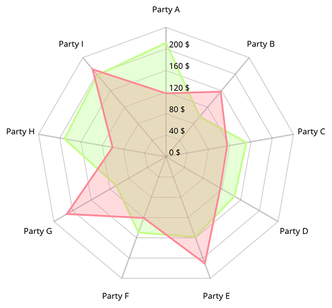

# MPAndroidChart

实例以`3.1.0`版本演示

基本类型

* `LineChart`折线图
    
* `BarChart`柱状图
    
    
* `ScatterChart`散点图
    
* `CandleStickChart`烛台图
    
* `PieChart`饼图
    
* `BubbleChart`气泡图
    
* `RadarChart`雷达图
    
* `CombinedChart`组合图
    

## 基本设置

* 使用`invalidate`可以刷新重绘
* `notifyDataSetChanged`当数据变化时使用该方法重新计算偏移量，最大值，最小值等内容
* `setLogEnabled`打印日志
* `setDescription`说明，用来控制图表说明，可以设置启用禁用、字体、大小、颜色、位置、文字对齐方式、位置偏移量
* `setNoDataText`无数据时显示的文字还可以使用`setNoDataTextColor`设置颜色`setNoDataTextTypeface`设置字体
* `setGridBackgroundColor`绘制图表网格背景颜色
* `setDrawGridBackground`是否绘制图表网格背景颜色，默认为false
* `setDrawBorders`图表四边边框绘制
* `setBorderColor`边框颜色
* `setBorderWidth`边框宽度
* `setTouchEnabled`所有触摸操作
* `setDragEnabled`拖动控制
* `setScaleEnabled`缩放控制
* `setScaleXEnabled`X轴缩放
* `setScaleYEnabled`Y轴缩放
* `setPinchZoom`双轴同时缩放，默认为false
* `setDoubleTapToZoomEnabled`双击放大
* `setHighlightPerDragEnabled`拖动时高亮值是否会变化
* `setHighlightPerTapEnabled`点击时是否高亮显示值
* `setDragDecelerationEnabled`滑动抛掷时是否会继续滚动
* `setDragDecelerationFrictionCoef`滑动抛掷时摩擦系数0-1
* `highlightValues`高亮值
* `setOnChartValueSelectedListener`高亮值选中时的回调
* `setOnChartGestureListener`手势操作回调
* `Entry`表示数据实体可以设置X/Y坐标值，绘制的图片和数据对象

### 坐标轴
XAxis为横坐标、YAxis纵坐标
* `setEnabled`控制与该轴相关的内容绘制
* `setPosition`坐标轴绘制位置，顶部或底部等几个位置
* `setDrawAxisLine`坐标轴线绘制
* `setDrawGridLines`网格线绘制
* `setDrawLabels`坐标轴标签绘制
* `setTextColor`轴标签的颜色。
* `setTextSize`轴标签的文字大小。
* `setTypeface`轴标签的 Typeface。
* `setGridColor`该轴的网格线颜色。
* `setGridLineWidth`该轴网格线的宽度。
* `setAxisLineColor`轴线的轴的颜色。
* `setAxisLineWidth`该轴轴行的宽度。
* `enableGridDashedLine`虚线

### 限制线

`LimitLine`表示限制线，限制线可以用来标识一些特定的值，使用`addLimitLine`添加，`removeLimitLine`用来删除

* `setDrawLimitLinesBehindData`默认限制线会绘制在数据下面，设置为true则会会在在数据上面

### X轴坐标

`Line`/`Bar`/`Scatter`/`CandleStick`/`RadarChart`都有横坐标

* `setAvoidFirstLastClipping`如果为true则避免裁剪掉X轴上第一个和最后一个坐标值
* `setValueFormatter`设置坐标轴上的格式

### Y轴坐标

`Line`/`Bar`/`Scatter`/`CandleStick`都有Left/Right左右两个纵坐标，通过`getAxisLeft`和`getAxisRight`获取，`RadarChart`只有一个`YAxis`

* `setAxisMinimum`设置坐标轴最小值
* `setAxisMaximum`设置坐标轴最大值
* `setInverted`设置值反转，最大值在下面
* `setSpaceTop`设置最高值顶部空间占最高值百分百，例如设置50则空白处占整个控件高度的1/3
* `setSpaceBottom`设置最高值底部空间占最高值百分百，例如设置50则空白处占整个控件高度的1/3
* `setLabelCount`设置Y轴标签数量，但这个数量不是强制的，如果`force `为true则会强制固定数量，但可能出现轴线不均匀
* `setPosition`设置Y轴标签在内部或外部

### CharData数据类	

`CharData`是所有数据类的基础类

* `setDrawValues`绘制数据的文本值
* `setValueTextColor`绘制数据文本值颜色
* `setValueTextSize`绘制数据文本值大小
* `setValueTypeface`绘制数据文本值字体
* `setValueFormatter`设置自定义内容
* `setHighlightEnabled`允许高亮
* `contains`检查包含某值
* `getDataSetByIndex`返回指定数据
* `xxxColor`设置数据颜色

### ValueFormatter自定义数据格式

* `getFormattedValue`绘制任何值都会调用的方法
* `getAxisLabel`绘制轴坐标
* `getBarLabel`绘制柱状图
* `getBarStackedLabel`绘制堆叠条形图
* `getPointLabel`绘制散点值
* `getPieLabel`绘制饼图
* `getRadarLabel`绘制雷达
* `getBubbleLabel`绘制气泡图
* `getCandleLabel`绘制烛台图

### 默认自定义格式

* `IndexAxisValueFormatter`通过下标返回指定值
* `PercentFormatter`返回带逗号的数字保留一位小数，带%可以在饼图中使用
* `DefaultValueFormatter`默认格式，返回带逗号的数字保留一位小数
* `DefaultAxisValueFormatter`默认轴图，返回带逗号的数字保留一位小数
* `StackedValueFormatter`堆叠条形图
* `LargeValueFormatter`大数字显示，会按`k`/`m`/`b`/`t`显示

### 图例Legend

默认所有图标都支持图例，每组数据会有一个图例使用`getLegend`获取`Legend`

* `setEnabled`是否启用
* `setTextColor`字体颜色
* `setTextSize`字体大小
* `setTypeface`字体样式
* `setPosition`设置图例位置
* `setFormSize`设置图例大小
* `setForm`设置图例样式，方形、圆形、线

### 动画

给`chart`设置不同的`animateXxxx`来执行不同动画

### MarkerView标记

`MarkerView`用于点击值时突出内容的类，首先继承`MarkerView `重写`refreshContent`方法，重写`getOffset`来控制位置，默认左上角将会绘制在内容上

```kotlin
class MyView(context: Context, layoutResource: Int) : MarkerView(context, layoutResource) {
    val tv by lazy { findViewById<TextView>(R.id.tv) }

    override fun refreshContent(e: Entry?, highlight: Highlight?) {
        if (e?.data is String) {
            tv.setText(e.data.toString())
        }
        super.refreshContent(e, highlight)
    }

    override fun getOffset(): MPPointF? {
        return MPPointF((-(width / 2)).toFloat(), (-height).toFloat())
    }
}
```


### LineChart

首先添加数据集合`List<Entry`，然后将数据

