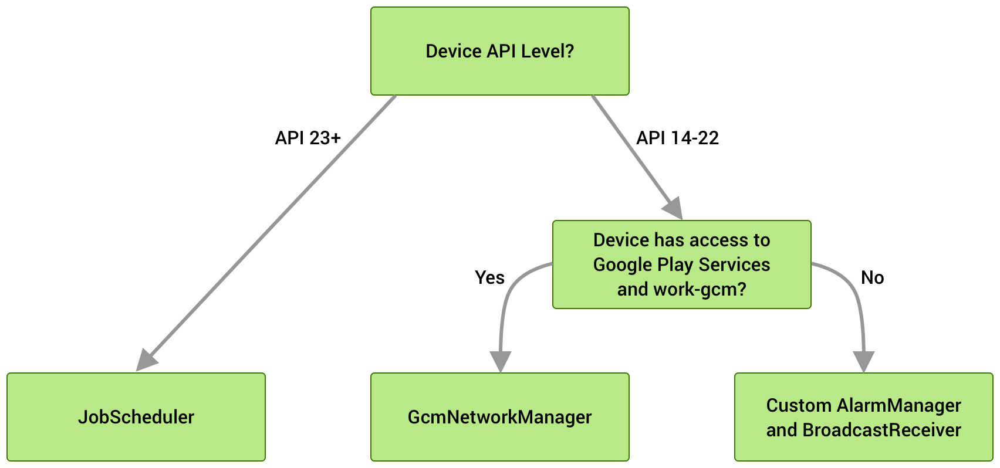

# WorkManager使用

https://developer.android.google.cn/topic/libraries/architecture/workmanager?hl=zh-cn

WorkManager可以让任务在退出或重启设备后仍可以执行，WorkManager会根据版本调用不同的组件



## 功能

除了具有简单一致的API之外，还有一些其他功能

### 工作约束

使用工作约束明确定义工作运行的最佳条件，例如仅wifi连接时，当设备空闲时）

### 强大的调度

WorkMangaer允许你使用灵活的调度窗口调度工作，以运行一次或重复的工作。还可以对工作进行标记或命名，以便调度唯一的、可替换的工作及监控或取消工作组。调度工作存储在内部托管的sqlite数据库中，由WorkManager负责确保该工作持续进行，并在设备重启后重新调度。

### 灵活的重试策略

有时工作会失败，WorkManager提供了灵活的重试策略，包括可配置的指数退避策略

### 工作链接

对于负责的相关工作，可以将各个工作任务链接在一起，这样可以控制顺序执行

**WorkManeger适用于可延期的工作，即不需要立即执行单需要可靠运行的工作，即使用户退出或设备重启也不收影响**

**WorkManager 不适用于应用进程结束时能够安全终止的运行中后台工作，也不适用于需要立即执行的工作。**

## 入门

```groovy
dependencies {
  def work_version = "2.4.0"

    // (Java only)
    implementation "androidx.work:work-runtime:$work_version"

    // Kotlin + coroutines
    implementation "androidx.work:work-runtime-ktx:$work_version"

    // optional - RxJava2 support
    implementation "androidx.work:work-rxjava2:$work_version"

    // optional - GCMNetworkManager support
    implementation "androidx.work:work-gcm:$work_version"

    // optional - Test helpers
    androidTestImplementation "androidx.work:work-testing:$work_version"
  }
```

### 定义工作

创建类继承`Worker`重写`doWork()`方法

```kotlin
class UploadWorker(appContext: Context, workerParams: WorkerParameters): Worker(appContext, workerParams) {
   override fun doWork(): Result {

       // Do the work here--in this case, upload the images.
       uploadImages()

       // Indicate whether the work finished successfully with the Result
       return Result.success()
   }
}
```

如果使用`Kotlin`添加了`work-runtime-ktx`则可以使用以下代码

```kotlin
class CoroutineDownloadWorker(context: Context, params: WorkerParameters) : CoroutineWorker(context, params) {

    override suspend fun doWork(): Result = coroutineScope {
        val jobs = (0 until 100).map {
            async {
                downloadSynchronously("https://www.google.com")
            }
        }

        // awaitAll will throw an exception if a download fails, which
        // CoroutineWorker will treat as a failure
        jobs.awaitAll()
        Result.success()
    }
}
```

此外，WorkManager KTX 还向 `Operations` 和 `ListenableFutures` 添加扩展函数以暂停当前协程。

```kotlin
// Inside of a coroutine...

// Run async operation and suspend until completed.
WorkManager.getInstance()
        .beginWith(longWorkRequest)
        .enqueue().await()

// Resume after work completes..
```

从`doWork()`返回的Result会通知WorkManager服务工作是否成功，以及失败时是否重试

* `Result.success()`：工作成功完成。
* `Result.failure()`：工作失败。
* `Result.retry()`：工作失败，应根据其重试政策在其他时间尝试。

### 创建WorkRequest

定义工作后必须使用WorkManager服务进行调度才能运行。工作可以在一段时间内定期运行，可以仅运行一次。不论以何种方式调度工作，请始终使用`WorkRequest`。

```kotlin
//定义执行一次的工作
val uploadWorkRequest: WorkRequest =
   OneTimeWorkRequestBuilder<UploadWorker>()
       .build()
```

将`WorkRequest`交个系统

```kotlin
WorkManager
    .getInstance(myContext)
    .enqueue(uploadWorkRequest)
```

工作的执行取决于`WorkRequest`中使用的约束和系统优化方式

## 定义工作请求

工作通过`WrokRequest`在`WorkManager`中定义

```kotlin
val myWorkRequest = ...
WorkManager.getInstance(myContext).enqueue(myWorkRequest)
```

WorkRequest 对象包含 WorkManager 调度和运行工作所需的所有信息。其中包括运行工作必须满足的约束、调度信息（例如延迟或重复间隔）、重试配置，并且可能包含输入数据（如果工作需要）。

`WorkRequest` 本身是抽象基类。该类有两个派生实现，可用于创建 `OneTimeWorkRequest` 和 `PeriodicWorkRequest` 请求。顾名思义，`OneTimeWorkRequest` 适用于调度非重复性工作，而 `PeriodicWorkRequest` 则更适合调度以一定间隔重复执行的工作。

### 调度一次性工作

对于无序额外配额制的工作可以使用静态方法`from`

```kotlin
val myWorkRequest = OneTimeWorkRequest.from(MyWork::class.java)
```

复杂的工作可以使用构建器

```kotlin
val uploadWorkRequest: WorkRequest =
   OneTimeWorkRequestBuilder<MyWork>()
       // Additional configuration
       .build()
```

### 调度定期工作

当应用需要定期执行某些工作时。例如定期备份数据，定期下载新内容

```kotlin
val saveRequest =
       PeriodicWorkRequestBuilder<SaveImageToFileWorker>(1, TimeUnit.HOURS)
    // Additional configuration
           .build()
```

此示例，工作间隔为一小时。

时间间隔为两次重复执行之间最短时间。工作执行时间取决于设置的约束及系统优化

**可以定义的最短重复间隔时间为15分钟（与JobScheduler api相同）**

### 灵活的运行间隔

如果工作的性质致使其对运行时间敏感，可以将 `PeriodicWorkRequest`配置为在每个时间间隔的灵活时段内运行


如需定义具有灵活时间段的定期工作，请在创建 `PeriodicWorkRequest` 时传递 `flexInterval` 以及 `repeatInterval`。灵活时间段从 `repeatInterval - flexInterval` 开始，一直到间隔结束。

以下是可在每小时的最后 15 分钟内运行的定期工作的示例。

```kotlin
val myUploadWork = PeriodicWorkRequestBuilder<SaveImageToFileWorker>(
       1, TimeUnit.HOURS, // repeatInterval (the period cycle)
       15, TimeUnit.MINUTES) // flexInterval
    .build()
```

重复间隔必须大于或等于 `PeriodicWorkRequest.MIN_PERIODIC_INTERVAL_MILLIS`，而灵活间隔必须大于或等于 `PeriodicWorkRequest.MIN_PERIODIC_FLEX_MILLIS`。

### 工作约束

约束可确保将工作延迟到满足最佳条件时运行。以下约束适用于 `WorkManager`。

| 约束类型    | 说明 |
| ----------- | ---- |
| NetworkType | 约束运行工作所需的网络类型。`CONNECTED`任何有效的网络连接、`METERED`使用计量网络（流量）、`NOT_REQUIRED`不需要网络、`NOT_ROAMING`非漫游网络、`UNMETERED`非计量网络（WIFI） |
|BatteryNotLow| 如果设置为 true，那么当设备处于“电量不足模式”时，工作不会运行。 |
|RequiresCharging| 如果设置为 true，那么工作只能在设备充电时运行。 |
|DeviceIdle| 如果设置为 true，则要求用户的设备必须处于空闲状态，才能运行工作。如果您要运行批量操作，否则可能会降低用户设备上正在积极运行的其他应用的性能，建议您使用此约束。 |
|StorageNotLow| 如果设置为 true，那么当用户设备上的存储空间不足时，工作不会运行。 |

如需创建一组约束并将其与某项工作相关联，请使用一个 `Contraints.Builder()` 创建 `Constraints` 实例，并将该实例分配给 `WorkRequest.Builder()`。

例如，以下代码会构建了一个工作请求，该工作请求仅在用户设备正在充电且连接到 Wi-Fi 网络时才会运行：

```kotlin
val constraints = Constraints.Builder()
   .setRequiredNetworkType(NetworkType.UNMETERED)
   .setRequiresCharging(true)
   .build()

val myWorkRequest: WorkRequest =
   OneTimeWorkRequestBuilder<MyWork>()
       .setConstraints(constraints)
       .build()
```

如果指定了多个约束，工作将仅在满足所有约束时才会运行。

如果在工作运行时不再满足某个约束，WorkManager 将停止工作器。系统将在满足所有约束后重试工作。

### 延迟工作

如果工作没有约束或加入时所有约束就得到满足，那么系统可能会立即执行该工作，如果不希望立即执行，可以将工作指定在经过一段时间后延迟执行

以下代码将工作延迟10分钟运行

```kotlin
val myWorkRequest = OneTimeWorkRequestBuilder<MyWork>()
   .setInitialDelay(10, TimeUnit.MINUTES)
   .build()
```

定期工作只会在首次运行时延迟

### 重试和退避政策

如果要让`WrokManager`重试工作，可以从工作返回`Result.retry()`。然后系统根据退避延迟时间和退避政策重新调度工作

* 退避延迟时间指定了首次尝试后重试的最短等待时间。此值不能超过10秒或（MIN_BACKOFF_MILLIS）
* 退避政策定义了后续重试过程中退避延迟时间以怎样的方式增长。`WorkManager`支持两个退避政策即 `LINEAR`（线性） 和 `EXPONENTIAL`（指数）

每个工作都有退避政策和延迟时间，默认为政策是`EXPONENTIAL`，时间为10秒

```
val myWorkRequest = OneTimeWorkRequestBuilder<MyWork>()
   .setBackoffCriteria(
       BackoffPolicy.LINEAR,
       OneTimeWorkRequest.MIN_BACKOFF_MILLIS,
       TimeUnit.MILLISECONDS)
   .build()
```

在本示例中，最短退避延迟时间设置为允许的最小值，即 10 秒。由于政策为 `LINEAR`，每次尝试重试时，重试间隔都会增加约 10 秒。例如，第一次运行以 `Result.retry()` 结束并在 10 秒后重试；然后，如果工作在后续尝试后继续返回 `Result.retry()`，那么接下来会在 20 秒、30 秒、40 秒后重试，以此类推。如果退避政策设置为 `EXPONENTIAL`，那么重试时长序列将接近 20、40、80 秒，以此类推。

**退避延迟时间不精确，在两次重试之间可能会有几秒钟的差异，但绝不会低于配置中指定的初始退避延迟时间。**

### 标记工作

每个工作都有一个唯一标识符，该标识符可以用于标示该工作，以便取消或观察进度

`WorkManager.cancelAllWorkByTag(String)` 会取消带有特定标记的所有工作请求，`WorkManager.getWorkInfosByTag(String)` 会返回一个 WorkInfo 对象列表，该列表可用于确定当前工作状态。

```kotlin
val myWorkRequest = OneTimeWorkRequestBuilder<MyWork>()
   .addTag("cleanup")
   .build()
```

最后，可以向单个工作请求添加多个标记。这些标记在内部以一组字符串的形式进行存储。对于工作请求，您可以通过 WorkRequest.getTags() 检索其标记集。

### 分配输入数据

工作可能需要输入数据才能正常工作。

输入的值一键值对的形式存储在`Data`对象中，`Worker` 类可通过调用 `Worker.getInputData()` 访问输入参数。以下代码展示了如何创建需要输入数据的 `Worker` 实例，以及如何在工作请求中发送该实例。

```kotlin
// Define the Worker requiring input
class UploadWork(appContext: Context, workerParams: WorkerParameters)
   : Worker(appContext, workerParams) {

   override fun doWork(): Result {
       val imageUriInput =
           inputData.getString("IMAGE_URI") ?: return Result.failure()

       uploadFile(imageUriInput)
       return Result.success()
   }
   ...
}

// Create a WorkRequest for your Worker and sending it input
val myUploadWork = OneTimeWorkRequestBuilder<UploadWork>()
   .setInputData(workDataOf(
       "IMAGE_URI" to "http://..."
   ))
   .build()
```

同样，可使用 `Data` 类输出返回值。如需详细了解输入和输出数据。

## 工作状态

### 一次性工作

对于一次性工作，初试状态为`ENQUEUED`。

在 `ENQUEUED` 状态下，您的工作会在满足其 `Constraints`和初始延迟计时要求后立即运行。接下来，该工作会转为 `RUNNING`状态，然后可能会根据工作的结果转为 `SUCCEEDED`、`FAILED`状态；或者，如果结果是 `retry`，它可能会回到 `ENQUEUED` 状态。在此过程中，随时都可以取消工作，取消后工作将进入 `CANCELLED`状态。


`SUCCEEDED`、`FAILED` 和 `CANCELLED` 均表示此工作的终止状态。如果您的工作处于上述任何状态，`WorkInfo.State.isFinished()` 都将返回 true。

### 定期工作

成功和失败状态仅适用于一次性工作和链式工作。定期工作只有一个终止状态 `CANCELLED`。这是因为定期工作永远不会结束。每次运行后，无论结果如何，系统都会重新对其进行调度。


还有一种我们尚未提到的最终状态，那就是 `BLOCKED`。此状态适用于一系列已编排的工作，或者说工作链。链接工作中介绍了工作链及其状态图。

## 管理工作

定义`Worker`和`WorkRequest`后，最后一步将工作加入队列中

```kotlin
val myWork: WorkRequest = // ... OneTime or PeriodicWork
WorkManager.getInstance(requireContext()).enqueue(myWork)
```

在将工作加入队列时请小心谨慎，以避免重复。例如，应用可能会每 24 小时尝试将其日志上传到后端服务。如果不谨慎，即使作业只需运行一次，您最终也可能会多次将同一作业加入队列。为了实现此目标，您可以将工作调度为唯一工作。

### 唯一工作

唯一工作是一个很实用的概念，可确保同一时刻只有一个具有特定名称的工作实例。与 ID 不同的是，唯一名称是人类可读的，由开发者指定，而不是由 WorkManager 自动生成。与标记不同，唯一名称仅与一个工作实例相关联。

唯一工作既可用于一次性工作，也可用于定期工作。您可以通过调用以下方法之一创建唯一工作序列，具体取决于您是调度重复工作还是一次性工作。

* `WorkManager.enqueueUniqueWork()`（用于一次性工作）
* `WorkManager.enqueueUniquePeriodicWork()`（用于定期工作）

这两种方法都接受 3 个参数：

- uniqueWorkName - 用于唯一标识工作请求的 `String`。
- existingWorkPolicy - 此 `enum` 可告知 WorkManager 如果已有使用该名称且尚未完成的唯一工作链，应执行什么操作。
- work - 要调度的 `WorkRequest`。

```kotlin
val sendLogsWorkRequest =
       PeriodicWorkRequestBuilder<SendLogsWorker>(24, TimeUnit.HOURS)
           .setConstraints(Constraints.Builder()
               .setRequiresCharging(true)
               .build()
            )
           .build()
WorkManager.getInstance(this).enqueueUniquePeriodicWork(
           "sendLogs",
           ExistingPeriodicWorkPolicy.KEEP,
           sendLogsWorkRequest
)
```

现在，如果上述代码在 sendLogs 作业已处于队列中的情况下运行，系统会保留现有的作业，并且不会添加新的作业。

### 冲突解决政策

调度唯一工作时，您必须告知 WorkManager 在发生冲突时要执行的操作。您可以通过在将工作加入队列时传递一个枚举来实现此目的。

对于一次性工作，您需要提供一个 `ExistingWorkPolicy`它支持用于处理冲突的 4 个选项。

- `REPLACE`：用新工作替换现有工作。此选项将取消现有工作。
- `KEEP`：保留现有工作，并忽略新工作。
- `APPEND`：将新工作附加到现有工作的末尾。此政策将导致您的新工作链接到现有工作，在现有工作完成后运行。

现有工作将成为新工作的先决条件。如果现有工作变为 `CANCELLED` 或 `FAILED` 状态，新工作也会变为 `CANCELLED` 或 `FAILED`。如果您希望无论现有工作的状态如何都运行新工作，请改用 `APPEND_OR_REPLACE`。

- `APPEND_OR_REPLACE`功能类似于 `APPEND`，不过它并不依赖于**先决条件**工作状态。即使现有工作变为 `CANCELLED` 或 `FAILED` 状态，新工作仍会运行。

**对于定期工作，您需要提供一个 `ExistingPeriodicWorkPolicy`，它支持 `REPLACE` 和 `KEEP` 这两个选项。这些选项的功能与其对应的 ExistingWorkPolicy 功能相同。**

### 观察工作

在将工作加入队列后，您可以随时按其 `name`、`id` 或与其关联的 `tag` 在 WorkManager 中进行查询，以检查其状态。

```kotlin
// by id
workManager.getWorkInfoById(syncWorker.id) // ListenableFuture<WorkInfo>

// by name
workManager.getWorkInfosForUniqueWork("sync") // ListenableFuture<List<WorkInfo>>

// by tag
workManager.getWorkInfosByTag("syncTag") // ListenableFuture<List<WorkInfo>>
```

该查询会返回 `WorkInfo`对象的 `ListenableFuture`，该值包含工作的 `id`、其标记、其当前的`State`以及通过`Result.success(outputData)` 设置的任何输出数据。

利用每个方法的 `LiveData`变种，您可以通过注册监听器来观察 `WorkInfo` 的变化。例如，如果您想要在某项工作成功完成后向用户显示消息，您可以进行如下设置：

```kotlin
workManager.getWorkInfoByIdLiveData(syncWorker.id)
               .observe(viewLifecycleOwner) { workInfo ->
   if(workInfo?.state == WorkInfo.State.SUCCEEDED) {
       Snackbar.make(requireView(),
      R.string.work_completed, Snackbar.LENGTH_SHORT)
           .show()
   }
}
```

#### 复杂的工作查询

WorkManager 2.4.0 及更高版本支持使用 `WorkQuery`对象对已加入队列的作业进行复杂查询。WorkQuery 支持按工作的标记、状态和唯一工作名称的组合进行查询。

以下示例说明了如何查找带有“syncTag”标记、处于 `FAILED` 或 `CANCELLED` 状态，且唯一工作名称为“preProcess”或“sync”的所有工作。

```kotlin
val workQuery = WorkQuery.Builder
       .fromTags(listOf("syncTag"))
       .addStates(listOf(WorkInfo.State.FAILED, WorkInfo.State.CANCELLED))
       .addUniqueWorkNames(listOf("preProcess", "sync")
    )
   .build()

val workInfos: ListenableFuture<List<WorkInfo>> = workManager.getWorkInfos(workQuery)
```

### 取消和停止工作

如果您不再需要运行先前加入队列的工作，则可以要求将其取消。您可以按工作的 `name`、`id` 或与其关联的 `tag` 取消工作。

```kotlin
// by id
workManager.cancelWorkById(syncWorker.id)

// by name
workManager.cancelUniqueWork("sync")

// by tag
workManager.cancelAllWorkByTag("syncTag")
```

WorkManager 会在后台检查工作的 `State`。如果工作已经完成，系统不会执行任何操作。否则，工作的状态会更改为 `CANCELLED`，之后就不会运行这个工作。任何依赖于此工作的 `WorkRequest`作业也将变为 `CANCELLED`。

目前，`RUNNING`可收到对`ListenableWorker.onStopped()`的调用。如需执行任何清理操作，请替换此方法。

### 停止正在运行的工作器

正在运行的 `Worker` 可能会由于以下几种原因而停止运行：

- 您明确要求取消它（例如，通过调用 `WorkManager.cancelWorkById(UUID)` 取消）。
- 如果是唯一工作，您明确地将`ExistingWorkPolicy`为 `REPLACE`的新 `WorkRequest` 加入到了队列中。旧的 `WorkRequest` 会立即被视为已取消。
- 您的工作约束条件已不再满足。
- 系统出于某种原因指示您的应用停止工作。如果超过 10 分钟的执行期限，可能会发生这种情况。该工作会调度为在稍后重试。

在这些情况下，您的工作器会停止。

您应该合作地取消正在进行的任何工作，并释放您的工作器保留的所有资源。例如，此时应该关闭所打开的数据库和文件句柄。有两种机制可让您了解工作器何时停止。

#### onStopped() 回调

在您的工作器停止后，WorkManager 会立即调用 `ListenableWorker.onStopped()`。替换此方法可关闭您可能保留的所有资源。

#### isStopped() 属性

您可以调用 `ListenableWorker.isStopped()` 方法以检查工作器是否已停止。如果您在工作器中执行长时间运行的操作或重复操作，您应经常检查此属性，并尽快将其用作停止工作的信号。

**注意**：WorkManager 会忽略已收到 onStop 信号的工作器所设置的 `Result`，因为工作器已被视为停止。

## 工作进度

## 工作链

