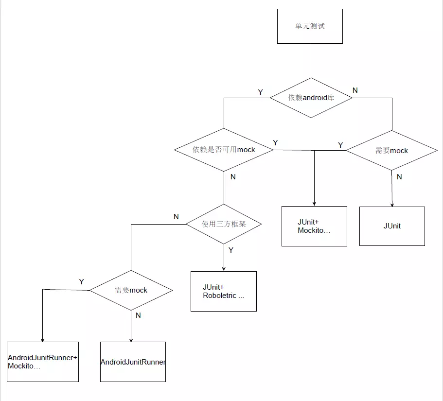

### Android单元测试
https://developer.android.com/studio/test  
https://developer.android.google.cn/training/testing/

单元测试分为本地单元测试和设备测试。
* 本地单元测试  
位于module-name/src/test/java/。这些测试在JVM中运行，当测试依赖Android相关框架或模拟Android框架时，可以使用本地测试来缩短执行时间。
在运行时，这些测试的执行对象都是去掉了final修饰符的修改版`android.jar`，这样就可以使用Mockito之类的常见模拟库。
* 设备测试  
位于module-name/src/androidTest/java。这些测试在硬件或模拟器上运行。这些测试有权访问`Instrumentation`API，可以获取某些信息（例如Context），并且运行通过测试代码来控制受测应用。在编写集成和功能界面测试来制动执行用户交互时，或当测试具有模拟对象无法满足的Android依赖项是，可以使用这些测试。  

    由于设备测试内置于apk中（与应用apk分离），因此他们必须有自己的AndroidManifest.xml。不过由于Gradle在编译期间自动生成此文件，因此他不会显示在项目中。

#### 添加新测试
**以下代码均为kotlin**
* 找到需要测试的代码
* 点击要测试的类或方法，按Ctrl+Shift+T
* 在菜单中点击Create New Test
* 在Create Test对话框中修改任何字段并选择要生成的任何方法，点击ok
* 在Choose Destination Directory中，点击要创建的测试类型，本地单元测试点击选择test，设备单元测试选择AndroidTest。  
* 或者在测试文件夹中自行创建测试文件

常用的测试框架有
* JUnit4
* AndroidJUnitRunner
* Mockito
* Espresso

  

#### JUnit4
使用JUnit4必须添加`testImplementation 'junit:junit:4.12'`，可选Mockito framework`testImplementation 'org.mockito:mockito-core:2.23.4'`如果使用kotlin则需要添加`testImplementation 'org.mockito:mockito-inline:2.23.4'`    
如果测试对Android框架有依赖，特别是有复杂的依赖最好使用Robolectric，如果对Android依赖较小则可以使用Mockito
* 注意事项
    * 测试方法必须使用@Test修饰
    * 测试方法必须为public void
    * 每个测试方法必须可以单独测试，互相不能有依赖
* 注解
    * @Test：将方法修饰为测试方法，(expected=XXException.class) 异常测试，需要抛出指定类型异常，(timeout=xx)超时测试
    * @BeforeClass：在所有方法执行前执行一次，静态方法
    * @Before：在每个方法执行前执行一次
    * @After：在每个方法执行后执行一次
    * @AfterClass：在所有方法执行后执行一次，静态方法
    * @Ignore：运行时忽略
    * @RunWhith：修改测试运行器
    * @Rule：重新制定测试类中方法的行为
* 断言（断言第一个String参数为错误时显示的信息）
    * assertEquals：相同
    * assertArrayEquals：数组相同
    * assertSame：引用相同
    * assertNotSame：不同引用
    * assertTrue：为真
    * assertFalse：为假
    * assertNull：为空
    * assertNotNull：不为空
    * assertThat：第三方断言，例如`CoreMatchers`，可以使用CoreMatchers.both来判断多个匹配器，继承BaseMatcher来实现自己的自定义断言

    |匹配器|说明|
    |-|-|
    |CoreMatchers.is                    |断言参数等于后面给出的匹配表达式|
    |CoreMatchers.not                   |断言参数不等于后面给出的匹配表达|
    |CoreMatchers.equalTo               |断言参数相等|
    |CoreMatchers.equalToIgnoringCase   |断言字符串相等忽略大小写|
    |CoreMatchers.containsString        |断言字符串包含某字符串|
    |CoreMatchers.startsWith            |断言字符串以某字符串开始|
    |CoreMatchers.endsWith              |断言字符串以某字符串结束|
    |CoreMatchers.nullValue             |断言参数的值为null|
    |CoreMatchers.notNullValue          |断言参数的值不为null|
    |CoreMatchers.greaterThan           |断言参数大于|
    |CoreMatchers.lessThan              |断言参数小于|
    |CoreMatchers.greaterThanOrEqualT   |断言参数大于等于|
    |CoreMatchers.lessThanOrEqualTo     |断言参数小于等于|
    |CoreMatchers.closeTo               |断言浮点型数在某一范围内|
    |CoreMatchers.allOf                 |断言符合所有条件，相当于&&|
    |CoreMatchers.anyOf                 |断言符合某一条件，相当于或|
    |CoreMatchers.hasKey                |断言Map集合含有此键|
    |CoreMatchers.hasValue              |断言Map集合含有此值|
    |CoreMatchers.hasItem               |断言迭代对象含有此元素|
    
* 参数化测试
    * 创建测试类给类添加`@RunWith(Parameterized::class)`
    * 给测试类添加构造函数传入参数及预期结果
    * 添加参数集合类，方法名不限制，**但必须为静态且添加了@Parameters注解**
    ```kotlin
    @RunWith(Parameterized::class)
    class MainActivityTest(val param: String?, val result: Boolean) {

        @Test
        fun testFun() {
            val b = param == null
            assertTrue("结果错误", b == result)
        }

        companion object {
            @JvmStatic
            @Parameterized.Parameters
            fun data(): Collection<Any> {
                return arrayListOf(arrayOf("abc", false), arrayOf(null, false))
            }
        }
    }
    ```
* 规则
    在`org.junit.rules.TestRule`子类为一些默认的规则例如`Timeout`超时规则，如果使用java代码所有规则必须为public
    ```kotlin
    @get:Rule
    val timeout = Timeout(1000, TimeUnit.MILLISECONDS)
    ```  
    自定义规则
    ```kotlin
    class CustomizeTestRule :TestRule{
        override fun apply(base: Statement?, description: Description?): Statement {
        return  object:Statement(){
            override fun evaluate() {
                //运行前的操作
                println( "开始${description?.className} ${description?.methodName}")
                base?.evaluate()//运行测试方法
                //运行后的操作
                println("结束${description?.className} ${description?.methodName}")
            }
        }
        }
    }
    ```
* 同时运行多个单元测试
    * 创建测试类
    * 给测试类添加`@RunWith(Suite::class)`及`@Suite.SuiteClasses(GPSUtilTest::class, MainActivityTest::class)`
    ```kotlin
    @RunWith(Suite::class)
    @Suite.SuiteClasses(GPSUtilTest::class, MainActivityTest::class)
    class SuiteTest
    ```
* Mock
    * 基础用法
    ```kotlin
    class MockTest {
        @Test
        fun test(): Unit {
            val person = mock(Person::class.java)
            assertNotNull(person)
        }
    }
    ```
    使用mock模拟类该类必须是不能是final Class
    * 注解方法
    ```kotlin
    class MockTest {

        @Mock
        lateinit var person2: Person

        @Before
        fun setup() {
            MockitoAnnotations.initMocks(this)
        }

        @Test
        fun test2(): Unit {
            assertNotNull(person2)
        }
    }
    ```
    * 运行器方法
    ```kotlin    
    @RunWith(MockitoJUnitRunner::class)
    class MockTest {
        @Mock
        lateinit var person3: Person

        @Test
        fun test3(): Unit {
            assertNotNull(person3)
        }
    }
    ```
    * MockitoRule方法
    ```kotlin
    class MockTest {
        @Mock
        lateinit var person4: Person
        
        @get:Rule
        val mockitoRule: MockitoRule = MockitoJUnit.rule()

        @Test
        fun test4(): Unit {
            assertNotNull(person4)
        }
    }
    ```
    * Mock打桩方法  
    由于`Mock`出的对象中非`void`方法都将返回默认值，`int`返回`0`对象返回`null`，使用`Mock`的给方法添加模拟返回值

    |方法名|方法描述|
    |-|-|
    |thenReturn(T value)|设置要返回的值
    |thenThrow(Throwable… throwables)|设置要抛出的异常|
    |thenAnswer(Answer<?> answer)|对结果进行拦截|
    |doReturn(Object toBeReturned)|提前设置要返回的值|
    |doThrow(Throwable… toBeThrown)|提前设置要抛出的异常|
    |doAnswer(Answer answer)|提前对结果进行拦截|
    |doCallRealMethod()|调用某一个方法的真实实现|
    |doNothing()|设置void方法什么也不做|

    ```kotlin
    @Test
    fun test3(): Unit {
        Mockito.`when`(person4.str).thenReturn("xx")
        Mockito.`when`(person4.str2).thenThrow(NullPointerException("xxxxxx"))

        println(person4.str)
        println(person4.str2)
        assertNotNull(person4)
    }
    ```
    then用于立即执行设置值，do用于提前设置
    ```kotlin
    Mockito.doReturn("ddddd").`when`(person4).str3
    println(person4.str3)
    ```
    * 常用验证方法

    |方法名|说明|
    |-|-|
    |after(long millis)|在给定的时间后进行验证|
    |timeout(long millis)|验证方法执行是否超时|
    |atLeast(int minNumberOfInvocations)|至少进行n次验证|
    |atMost(int maxNumberOfInvocations)|至多进行n次验证|
    |description(String description)|验证失败时输出的内容|
    |times(int wantedNumberOfInvocations)|验证调用方法的次数|
    |never()|验证交互没有发生,相当于times(0)|
    |only()|验证方法只被调用一次，相当于times(1)|
    ```kotlin
    @Test
    public void testPersonVerifyAtLeast(){
        mPerson.getAge();
        mPerson.getAge();
        //至少验证2次
        verify(mPerson, atLeast(2)).getAge();
    }
    ```
    * 常用匹配参数

    |方法名|说明|
    |-|-|
    |anyObject()|匹配任何对象|
    |any(Class&lt;T&gt; type)|与anyObject()一样|
    |any()|与anyObject()一样|
    |anyBoolean()|匹配任何boolean和非空Boolean|
    |anyByte()|匹配任何byte和非空Byte|
    |anyCollection()|匹配任何非空Collection|
    |anyDouble()|匹配任何double和非空Double|
    |anyFloat()|匹配任何float和非空Float|
    |anyInt()|匹配任何int和非空Integer|
    |anyList()|匹配任何非空List|
    |anyLong()|匹配任何long和非空Long|
    |anyMap()|匹配任何非空Map|
    |anyString()|匹配任何非空String|
    |contains(String substring)|参数包含给定的substring字符串|
    |argThat(ArgumentMatcher &lt;T&gt; matcher)|创建自定义的参数匹配模式|

    ```kotlin
    Mockito.`when`(person4.eat(Mockito.any(String::class.java))).thenReturn("eat")
    //输出eat
    println(person4.eat("eat2"))
    ```

    * 其他方法

    |方法名|说明|
    |-|-|
    |reset(T … mocks)|重置Mock|
    |spy(Class<T> classToSpy)|实现调用真实对象的实现|
    |inOrder(Object… mocks)|验证执行顺序|
    |@InjectMocks注解|自动将模拟对象注入到被测试对象中|
    
* 启用Robolectric http://robolectric.org  
    添加`testImplementation 'androidx.test:core:1.2.0'`、`testImplementation "org.robolectric:robolectric:4.2.1"`，如果方法超过65535则需要添加`testImplementation 'org.robolectric:shadows-multidex:4.1'`
    ```gradle
    android {
        testOptions {
            unitTests.includeAndroidResources = true
        }
    }
    ```
    robolectric代码
    ```kotlin
    @RunWith(RobolectricTestRunner.class)
    public class HttpTestDemo {
        @Test
        public void testHttpsRequest() {
        }
    }
    ```
    如果提示
    ```
    Downloading: org/robolectric/android-all/6.0.1_r3-robolectric-r1/android-all-6.0.1_r3-robolectric-r1.jar 
    from repository sonatype at https://oss.sonatype.org/content/groups/public/
    Transferring 69884K from sonatype
    ```
    则表示正在下载需要的jar包，一般下载很慢，不过可以到阿里云库将对应jcenter中的jar包下载下来，放到`C:\Users\用户名\.m2\repository\org\robolectric\android-all\xxxxxx`目录下  
    如果需要打印Logcat中的信息则需要添加
    ```kotlin
    companion object {
        @BeforeClass
        @JvmStatic
        fun setUp(): Unit {
            ShadowLog.stream = System.out
        }
    }
    ```
    例子，验证打开的activity是否正确
    ```kotlin
    @Test
    fun test() {
        println("开始测试")
        ActivityScenario.launch(MainActivity::class.java)
            .use { scenario ->
                scenario.onActivity { activity ->
                    activity.findViewById<Button>(R.id.btn_act).performClick()
                    val intent = Intent(activity, Main2Activity::class.java)
                    ApplicationProvider.getApplicationContext<Context>()
                    Assert.assertEquals(intent.component, Shadows.shadowOf(activity).nextStartedActivity.component)
                }
            }
        println("结束")
    }
    ```
    按指定声明周期调用
    ```kotlin
    @Test
    fun test2() {
        val act = Robolectric.buildActivity(MainActivity::class.java).create().start()
        val main = act.get()//在调用get前，已经调用onCreate,onStart
        act.resume()//此时调用resume       
    }
    ```
    完整生命周期
    ```kotlin
    Robolectric.buildActivity(MainActivity::class.java).create().start().resume().visible().get()
    ```
    * Config配置，配置有两种方法，一种是在test/resources/robolectric.properties中设置全局配置，或者使用@Config对类或方法单独设置。注解方法会覆盖全局配置文件
    robolectric.properties
    ```properties
    sdk=18
    manifest=xxxx.xml
    shadows=xxx.Shadow1,xxx.Shadow2
    ```
    * 配置Application使用`@Config(application = Application.class)`
    * 加载指定类型资源`@Config(qualifiers = "en")`，可以指定多种类型`@Config(qualifiers = "fr-rFR-w360dp-h640dp-xhdpi")` http://robolectric.org/device-configuration/
#### AndroidJUnitRunner
使用`AndroidJUnitRunner`需要添加`androidTestImplementation 'androidx.test:runner:1.2.0'`及`androidTestImplementation 'androidx.test.ext:junit:1.1.1'`，将测试类放置在androidTest目录下，且调用测试时需要真机或模拟器  
```gradle
 android {
    ...
    defaultConfig {
        ...
        testInstrumentationRunner "android.support.test.runner.AndroidJUnitRunner"
    }
}
```
注意事项
* 创建测试类，给类添加注解`@RunWith(AndroidJUnit4::class)`
* 给测试方法加上`@Test`

#### Espresso
使用`androidTestImplementation 'androidx.test.espresso:espresso-core:3.2.0'`可选`androidTestImplementation 'androidx.test.uiautomator:uiautomator:2.2.0'`