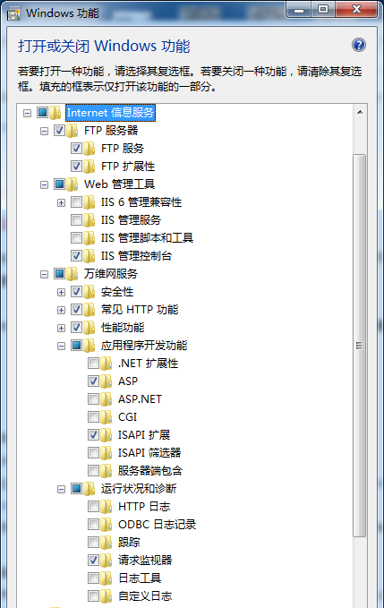

Bonobo Git Server
===
Bonobo Git Server是基于.net平台开发的ASP MVC网站所以需要IIS服务器
## 下载 Bonobo Git Server
https://bonobogitserver.com
## 启用IIS服务器
在控制面板->程序和功能->打开或关闭Windows功能，勾选  

## 配置Bonobo Git Server
* 将下载的压缩包解压放在`C:\inetpub\wwwroot`目录下
* 修改`APP_Data`目录权限
  * 在APP_Data文件夹上右键选择“属性”
  * 到“Security”（安全）的Tab页点击“Edit”（编辑）
  * 给IIS_IUSRS赋予Write和Modify权限。
* 打开`Internet信息服务(IIS)管理器`，将`Bonobo.Git.Server`右键转换为应用
* 选择`Bonobo.Git.Server`在主页打开`WebDAV创作规则`，右键添加创作规则，选择`所有内容`、`所有用户`
* 打开`http://localhost/Bonobo.Git.Server/`能正常打开表示配置完成，默认用户名admin admin
* 使用admin登录后可以在`全局设置->语言`修改语言，在`库目录`修改库保存目录