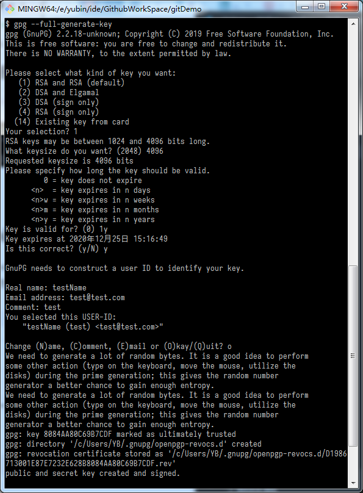
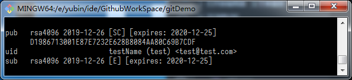

GPG证书
===
Git安装后首次提交代码时会要求输入用户名和邮箱，但如果两个用户设置相同用户名邮箱git本身并不能区分谁是谁它会认为这是同一个人，所以为了提交可靠git提供了GPG验证功能
## 生成GPG证书
* 首先打开`Git Bash`查看`GPG`版本`$ gpg --version`
* 如果版本在`2.1.17`以上则使用`gpg --full-generate-key`，如果以下则`gpg --default-new-key-algo rsa4096 --gen-key`
* 在选择加密模式，密码长度，过期时间，用户名(长度至少为5)，邮箱（不可重复），备注，密码(建议8位以上)后就会生成  


首次使用`GPG`会在`我的文档`下生成`.gnupg`目录并且生成信任数据库`trustdb.gpg`
* `gpg: key 8084AA80C69B7CDF marked as ultimately trusted`，`8084AA80C69B7CDF`为GPG key ID
* `gpg: revocation certificate stored as '/c/Users/.gnupg/openpgp-revocs.d/D1986713001E87E7232E628B8084AA80C69B7CDF.rev'`表示吊销证书位置
* `pub`主公钥的加密方式，过期日期及吊销证书文件名(`我的文档\.gnupg\openpgp-revocs.d`目录下)
* `uid`为用户名称，备注及邮箱
* `sub`子公钥的加密方式及过期时间

## 查看证书
* 查看公钥
  `gpg --list-key`或`gpg -k`，后可加上用户名，邮箱及GPG key ID来查询指定公钥
  ```
  pub   rsa4096 2019-12-26 [SC] [expires: 2020-12-25] D1986713001E87E7232E628B8084AA80C69B7CDF
  uid           [ultimate] testName (test) <test@test.com>
  sub   rsa4096 2019-12-26 [E] [expires: 2020-12-25]
  ```
* 查看私钥
  `gpg --list-secret-keys`或`gpg -K`，后可加上用户名，邮箱及GPG key ID来查询指定私钥
  ```
  sec   rsa4096 2019-12-26 [SC] [expires: 2020-12-25] D1986713001E87E7232E628B8084AA80C69B7CDF
  uid           [ultimate] testName (test) <test@test.com>
  ssb   rsa4096 2019-12-26 [E] [expires: 2020-12-25]
  ```
  * `sec`主私钥的加密方式，过期时间，吊销证书文件名(`我的文档\.gnupg\openpgp-revocs.d`目录下)
  * `uid`为用户名称，备注及邮箱
  * `ssb`子私钥的加密方式及过期时间

> 查看私钥公钥时添加`--keyid-format LONG`可以显示出GPG key ID
* 查看公钥内容`gpg --armor --export [GPG key ID]`或`gpg -a --export [GPG key ID]`
  * 密钥内容以`-----BEGIN PGP PUBLIC KEY BLOCK-----`开始，以`-----END PGP PUBLIC KEY BLOCK-----`结束。
* 删除key
  删除key必须先删除私钥再删除公钥
  * 删除私钥：`gpg --delete-secret-keys [GPG key ID]`
  * 删除公钥:`gpg --delete-keys [GPG key ID]`
* 导出key
  * 导出公钥：
    * `gpg --output [文件名] --armor --export [GPG key ID]`
    * `gpg -o [文件名] -a --export [GPG key ID]`
  * 导出私钥（需要密码）：
    * `gpg --output [文件名] --armor --export-secret-key [GPG key ID]`
    * `gpg -o [文件名] -a --export-secret-key [GPG key ID]`
* 导入key
  * 导入公钥`$ gpg --import [文件名]`
  * 导入私钥（需要密码）`gpg --allow-secret-key-import --import [文件名]`

**在上面使用过的命令中使用[GPG key ID]的地方也可以使用用户名替代，其他暂不确定**
```
 -s, --sign                  make a signature
     --clear-sign            make a clear text signature
 -b, --detach-sign           make a detached signature
 -e, --encrypt               encrypt data
 -c, --symmetric             encryption only with symmetric cipher
 -d, --decrypt               decrypt data (default)
     --verify                verify a signature
 -k, --list-keys             list keys
     --list-signatures       list keys and signatures
     --check-signatures      list and check key signatures
     --fingerprint           list keys and fingerprints
 -K, --list-secret-keys      list secret keys
     --generate-key          generate a new key pair
     --quick-generate-key    quickly generate a new key pair
     --quick-add-uid         quickly add a new user-id
     --quick-revoke-uid      quickly revoke a user-id
     --quick-set-expire      quickly set a new expiration date
     --full-generate-key     full featured key pair generation
     --generate-revocation   generate a revocation certificate
     --delete-keys           remove keys from the public keyring
     --delete-secret-keys    remove keys from the secret keyring
     --quick-sign-key        quickly sign a key
     --quick-lsign-key       quickly sign a key locally
     --sign-key              sign a key
     --lsign-key             sign a key locally
     --edit-key              sign or edit a key
     --change-passphrase     change a passphrase
     --export                export keys
     --send-keys             export keys to a keyserver
     --receive-keys          import keys from a keyserver
     --search-keys           search for keys on a keyserver
     --refresh-keys          update all keys from a keyserver
     --import                import/merge keys
     --card-status           print the card status
     --edit-card             change data on a card
     --change-pin            change a card's PIN
     --update-trustdb        update the trust database
     --print-md              print message digests
     --server                run in server mode
     --tofu-policy VALUE     set the TOFU policy for a key

Options:

 -a, --armor                 create ascii armored output
 -r, --recipient USER-ID     encrypt for USER-ID
 -u, --local-user USER-ID    use USER-ID to sign or decrypt
 -z N                        set compress level to N (0 disables)
     --textmode              use canonical text mode
 -o, --output FILE           write output to FILE
 -v, --verbose               verbose
 -n, --dry-run               do not make any changes
 -i, --interactive           prompt before overwriting
     --openpgp               use strict OpenPGP behavior

(See the man page for a complete listing of all commands and options)

Examples:

 -se -r Bob [file]          sign and encrypt for user Bob
 --clear-sign [file]        make a clear text signature
 --detach-sign [file]       make a detached signature
 --list-keys [names]        show keys
 --fingerprint [names]      show fingerprints

Please report bugs to <https://bugs.gnupg.org>.
```


## 向Github添加GPG密钥
和添加SSH密钥一样将内容完整复制进去即可
## 启用GPG提交
先设置对应的用户名、邮箱，然后设置GPG签名`git config user.signingKey [GPG key ID]`，并且启用`GPG`签名`$ git config commit.gpgSign true`然后提交即可