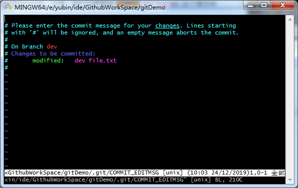

Git入门笔记
===
[官方文档](https://git-scm.com/book/zh/v2)
> 笔记是在http://www.liaoxuefeng.com/wiki/0013739516305929606dd18361248578c67b8067c8c017b000 网站学习git时所留下的
## 安装Git
***
从https://git-for-windows.github.io 或https://git-scm.com/ 下载安装版或绿色版
安装完成后从Git -> Git Bash 打开界面
安装完成后设置用户名和邮箱
```
$ git config --global user.name "Your Name"
$ git config --global user.email "email@example.com"
```
使用`--global`来做全局设置，也可对单个项目设置
### Git更新
***
更新可以在官网下载安装包更新也可以使用命令更新
* 2.17.1之前的版本`$ git update`
* 2.17.1之后的版本`$ git update-git-for-windows`
## Git使用

### 创建版本库
***
首先创建一个空目录（Git Bash默认路径在`我的文档`下，使用`cd`切换到需要创建git项目的目录下）
```
mkdir testProject
cd testProject
pwd
/c/Users/Administrator/testProject
```
`pwd`命令用于显示当前目录  
使用`$ git init`命令把该目录变成git可以管理的仓库
```
$ git init
Initialized empty Git repository in C:/Users/Administrator/testProject/.git/
```

### 帮助
***

使用`git --help`查看所有命令，使用`git <command> -h`查看某命令可以添加的参数及说明

### 添加文件 ###

***
使用`$ git add`命令将文件暂存到仓库
```
$ git add readme.txt
```
当执行该命名没有任何显示则表示添加成功，如果添加后可以使用`git restore --staged <file>...`还原到`add`之前的状态，如果使用继续使用`git restore <file>...`则修改的内容将被还原

### 提交文件
***

使用命令`$ git commit`将文件提交到仓库

```
$ git commit -m "wrote a readme file"
[master (root-commit) cfe8782] wrote a readme file
 1 file changed, 1 insertion(+)
 create mode 100644 readme.txt
```

命令中的`-m`后面添加的是提交说明
`$ git commit`命令执行成功后告诉我，一个文件修改，插入了1行内容
提交文件时可以同时提交多个文件

```
$ git add file1.txt
$ git add file2.txt file3.txt
$ git commit -m 'add 3 files'
```

如果提交时忘了加上`-m "msg"`，则会显示  
  
此时按下`inster`在最上方输入提交说明然后，按`Esc`在最下方输入`:wq`保存并提交

`commit`提交后想还原的话可以使用`git reset --soft HEAD^ <file...>`还原，`reset`有几种参数`--mixed`：不删除工作控件代码，撤销`commit`，撤销`add`；`--soft`：不删除工作控件代码，撤销`commit`；`--hear`：删除工作空间代码，撤销`commit`，撤销`add`

` git restore -s HEAD^ <file...>`还原到上一个版本修改的内容将不会保留，`HEAD`使用查看后面的代码

使用`git commit -a -m <message>`可以跳过`add`命令直接提交代码

如果使用`commit`后发现还有文件没提交并且不想分成两个提交记录则可以使用`commit --amend`来修改上次一的提交记录

### 查看状态
***
使用`$ git status`查看当前项目状态，如果没有修改则会显示为
```
$ git status
On branch master
nothing to commit, working tree clean
```
如果有内容修改则会显示
```
$ git status
On branch master
Changes not staged for commit:
  (use "git add <file>..." to update what will be committed)
  (use "git checkout -- <file>..." to discard changes in working directory)

        modified:   demo.txt

no changes added to commit (use "git add" and/or "git commit -a")
```
上面提示`demo.txt`被修改了   
使用`$ git diff`比较工作区和暂存区，`$ git diff HEAD -- filename`比较工作区和版本库的最新版本
```
$ git diff demo.txt
diff --git a/demo.txt b/demo.txt
index 74b316d..b410c2f 100644
--- a/demo.txt
+++ b/demo.txt
@@ -1 +1,2 @@
-git demo
\ No newline at end of file
+git demo
+status
\ No newline at end of file
```
`-`后面为删除的内容，`+`后面为添加的内容  
每次修改后都要先`add`然后`commit`，当使用`status`查看状态提示`nothing to commit, working tree clean`则表示本地以及提交完成了

### 日志查看
***

当使用`commit`命令提交过多次后可以使用`log`命令查看提交记录

```
$ git log
commit 75e662b773d11355a68c7d387fb1f34522904a7b (HEAD -> master)
Author: XX <xxx@qq.com>
Date:   Fri Dec 20 15:04:30 2019 +0800

    1

commit 158629582bcd899579b50e415c8acb411f0aec48
Author: XX <xxx@qq.com>
Date:   Fri Dec 20 14:54:03 2019 +0800

    c

commit 00015d666d6c74e66d4ff5316c7f1c4e4462badc
Author: XX <xxx@qq.com>
Date:   Fri Dec 20 14:53:28 2019 +0800

    com

commit 9bfc280b8886d763580caf3bd3c35a01aa5763db
Author: XX <xxx@qq.com>
Date:   Fri Dec 20 11:38:54 2019 +0800

    commit file
```
最上面显示最近的一次提交，每次提交一条记录`commit 9bfc280b8886d763580caf3bd3c35a01aa5763db`表示提交ID（提交ID是由SHA1计算出来的值），`Author: XX <xxx@qq.com>`表示作者和作者邮箱，`Date:   Fri Dec 20 11:38:54 2019 +0800`表示提交时间，`commit file`表示提交时输入的提交说明

可以添加` --pretty=oneline`参数减少日志展示信息
```
$ git log --pretty=oneline
75e662b773d11355a68c7d387fb1f34522904a7b (HEAD -> master) 1
158629582bcd899579b50e415c8acb411f0aec48 c
00015d666d6c74e66d4ff5316c7f1c4e4462badc com
9bfc280b8886d763580caf3bd3c35a01aa5763db commit file
```
### 版本退回

***

如果文件以及添加到暂存区但没有提交到工作空间，可以使用使用`git reset <file> HEAD`还原到修改前的状态，且保留文件修改，如果不想保留文件的修改项变成和工作空间一样的内容可以再次使用`git checkout -- <file>...`将文件内容还原，使用`git reset --hard <file> HEAD`等于同时执行了`checkout`命令


**`HEAD`表示为当前版本，`HEAD^`表示上一个版本，`HEAD^^`表示上上一个，每一个`^`表示向上跳一个版本，如果向上跳的版本太多可以使用`HEAD~数字`，`HEAD~100`表示向上跳100个版本，或者使用指定版本号来指定版本**

在使用`reset`后会发现指定版本以后的提交都不见了，只要命令行窗口没关，可以在使用

```
$ git reset --hard 75e662
HEAD is now at 75e662b 1
```
回到指定版本号，版本号不用写完整，但也不能太少，不然会找到多个版本

如果命令行页面关了忘了commit id，可以使用`reflog`查看操作日志
```
$ git reflog
75e662b (HEAD -> master) HEAD@{0}: reset: moving to 75e662
1586295 HEAD@{1}: reset: moving to HEAD^
75e662b (HEAD -> master) HEAD@{2}: commit: 1
1586295 HEAD@{3}: commit: c
00015d6 HEAD@{4}: commit: com
9bfc280 HEAD@{5}: commit (initial): commit file
```
但是在`git push`时会提示本地分支落后于远程分支，这时需要使用`git push -f`强制推送

但是只是某个提交出问题不是则可以使用`git revert [<options>] <commit-ish>...`，将某次提交反转操作

### 工作区暂存区

***
git和其他版本控制系统有个不同的地方就是，有`暂存区`，在电脑里能看见的文件都在`工作区`，当使用`add`命令后文件的修改就到`暂存区`了，当使用`commit`命令时就将修改提交到本地当前分支
### 撤销修改
***
当文件修改后发现不想修改了，只要没有使用`add`到暂存区，就可以使用`checkout --`还原之前的修改
```
$ git checkout -- demo.txt
```
当如果已经使用`add`暂存到暂存区，那需要先使用`reset`把暂存区的内容撤销然后再使用`checkout --`还原
```
$ git reset HEAD demo.txt
$ git checkout -- demo.txt
```
如果已经使用`commit`提交到本地库，先使用`$ git reset`
```
$ git reset --hard HEAD^(向上跳一个版本，也可以指定commit id)
HEAD is now at 75e662b 1

$ git reset HEAD demo.txt

$ git checkout -- demo.txt
```
### 删除文件
***
如果是为使用`add`添加到暂存区的文件，直接删除即可，如果是使用过`add`命令，可以先删除文件再使用`$ git rm`
```
rm test.txt

$ git rm test.txt
rm 'test.txt'
```
如果文件误删，可以使用`$ git checkout -- test.txt`来还原  
如果忘了在`.gitignore`添加忽略文件可以先修改`.gitignore`，再使用`git rm --cached <file>`来从库里面删除文件而保留本地文件，或者使用`git rm --cached *`把所有文件缓存删除重新判断是否需要提交

## 远程库
***
下面将以github为例子
### 创建并使用SSH Key
***
* 创建SSH Key
  `ssh-keygen -t rsa -C "youremail@example.com"`，然后回车选择文件保存位置及密码（密码可以为空），然后就可以在我的文档目录找到.ssh目录里面有`id_rsa`/`id_rsa.pub`两个文件，`id_rsa`为私钥不可公开，`id_rsa.pub`可以公开。加上` -f .ssh/xxxxx`可以在指定目录存放key文件
* 登录打开github找到`settting`->`SSH and GPG keys`->`New SSH key`输入`title`，把`id_rsa.pub`使用文本编辑器打开，内容复制到`key`，点击`Add SSH key`完成
### 创建项目
***
* 选择`New repository`->输入项目名(项目说明为选填)->选择是否公开项目->然后创建一个空项目
* 在git终端上输入`$ git remote add origin git@github.com:github2136/gitDemo.git`将本地库关联到远程库，这个内容可以从github的空项目中看到提示，默认为`http`需要切换到`ssh`，`origin`为默认名称，完全可以使用其他名称，如果关联远程库不小心输入错误可以使用`$ git remote rm origin`来删除然后重新输入
* `$ git push -u origin master`将本地项目推送到远程库，由于远程库是空的，我们第一次推送master分支时，加上了-u参数，Git不但会把本地的master分支内容推送的远程新的master分支，还会把本地的master分支和远程的master分支关联起来，在以后的推送或者拉取时就可以简化命令。
* 之后的提交可以直接使用`$ git push origin master`
### 远程库克隆
***
选择`Clone or Download`->`Clone with SSH`复制内容->跳转至需要下载项目的目录，执行`$ git clone git@github.com:github2136/gitDemo.git`->`cd gitDemo`
## 标签管理
***
在发布新版本时通常会在版本库中打上一个标签(tag)，这样查询某个发布版时更加容易
### 添加标签
***
首先切换到需要打标签的分支，然后使用`$ git tag v1.0`，打上标签。`$ git tag`查看所有标签  
默认标签是打在最新的`commit id`上，如果要打在指定`commit id`上可以使用`$ git tag v0.9 f52c633`，标签是按字符排序而不是添加时间排序  
如果要给标签添加说明可以使用`$ git tag -a v0.1 -m "version 0.1 released" 1094adb`，如果要查看标签详情可以使用`git show <tagname>`

### 操作标签
***
删除标签使用`$ git tag -d v0.1`，标签默认只在本地，如果要推送到远程使用`git push origin <tagname>`或推送所有标签`$ git push origin --tags`。如果要删除远程标签需要先删除本地标签然后再删除远程标签`git push origin :refs/tags/<tagname>`，或者使用`git push origin --delete <tagname>`删除指定标签
## 自定义git
***
### 关联不同的库


### 忽略文件
当某些文件不打算提交到git库上时，可以先在项目根目录新建一个`.gitignore`里面配置[忽略文件](https://github.com/github/gitignore)，如果忽略文件有问题忽略了不想忽略的文件可以使用`$ git check-ignore -v App.class`这个将返回哪条规则忽略了这个文件，或者使用`$ git add -f App.class`强制提交。  
如果先提交了某文件然后又想不提交忽略该文件可以执行以下语句
```
git rm -r --cached .
git add .
git commit -m 'update .gitignore'
```
忽略文件说明
```
# 此为注释 – 将被 Git 忽略

*.cs       # 忽略所有 .cs 结尾的文件
!ABC.cs    # 但 ABC.cs 除外
/BLL       # 仅仅忽略项目根目录下的 BLL 文件，不包括 subdir/BLL
build/     # 忽略 build/ 目录下的所有文件
doc/*.txt  # 会忽略 doc/notes.txt 但不包括 doc/server/arch.txt
```
### 配置别名
git可以给各种命令设置各种别名，从而减少输入`$ git config --global alias.st status`，加上`--global`表示为全局，本电脑都可使用，不加为本项目。每个项目`.git/config`里面`[alias]`表示项目设置的别名，如果不要删除对应的内容即可
```
[alias]
    last = log -1
```
全局设置在`我的文档/.gitconfig`里。
`$ git config --list`表示查看设置，`$ git config --global --list`查看全局设置