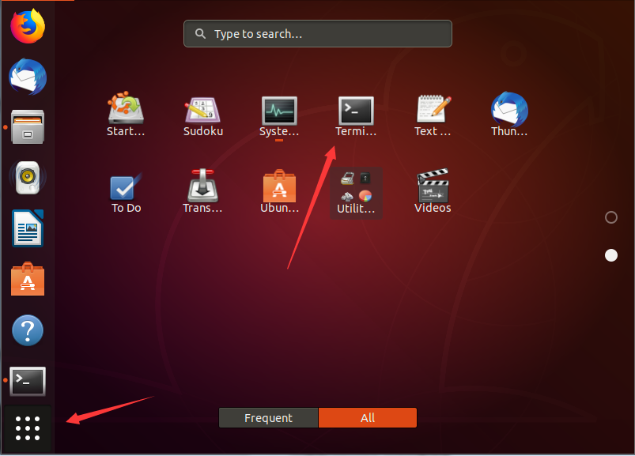
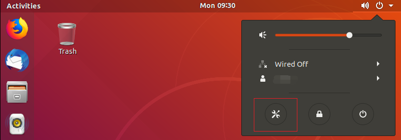
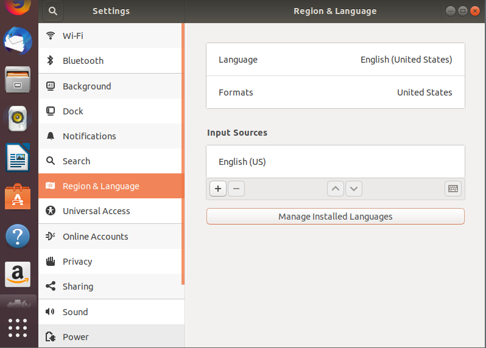
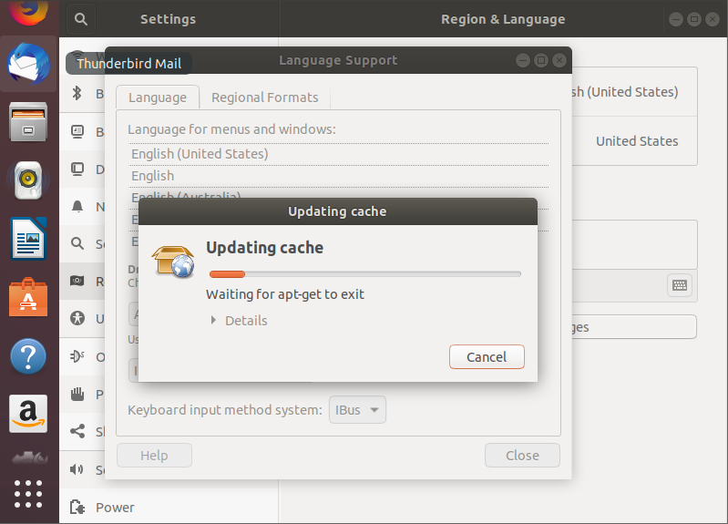
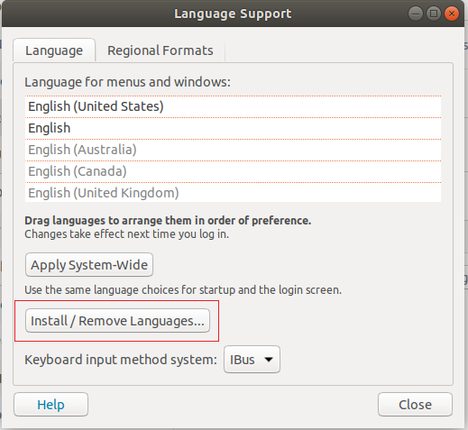
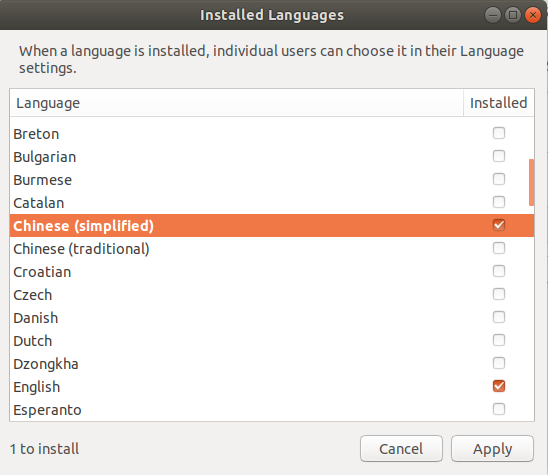
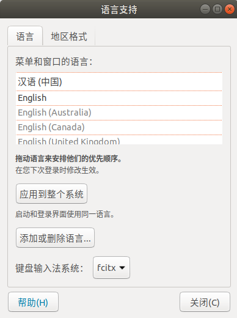
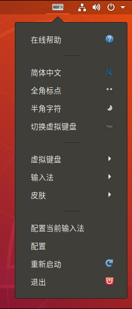
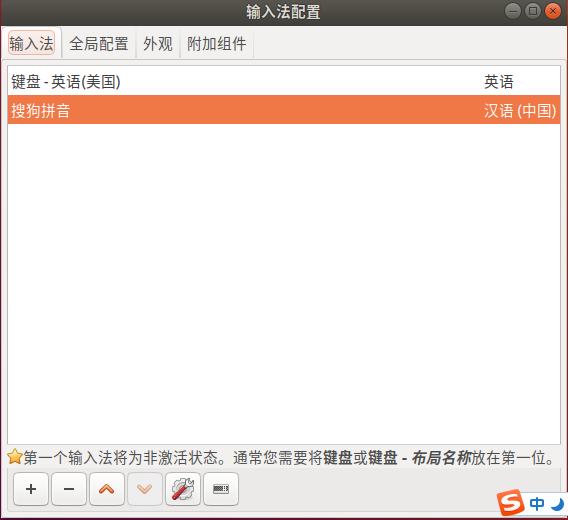

Ubuntu
===
Ubuntu是一个以桌面应用为主的Linux操作系统   

* VMware Workstation 15Pro
* Ubuntu 

## 下载Ubuntu
***
https://ubuntu.com

## 使用VM安装Ubuntu
***
选择“创建新的虚拟机”->“典型”->选择下载的Ubuntu ISO文件->输入用户名，密码，文件位置->等待安装完成

## 切换Source.list服务器地址
默认地址不是国内地址，下载更新都很慢可以切换为国内镜像地址以提高更新速度  
* 首先打开终端  
    
  备份源列表
  ```
  # 首先备份源列表
  sudo cp /etc/apt/sources.list /etc/apt/sources.list_backup
  ```
* 打开sources.list文件
  ```
  sudo gedit /etc/apt/sources.list 
  ```
* 复制清华镜像选择对应版本 https://mirrors.tuna.tsinghua.edu.cn/help/ubuntu/ 复制到sources.list后保存
* 刷新列表
  ```
  sudo apt-get update
  sudo apt-get upgrade
  sudo apt-get install build-essential
  ```
**注意右上角网络连接，如果显示有连接但无法上网，可以尝试将Wired Connected->Turn Off再连接**
## 切换为中文
***
  
  
  
  
  
下载完成后将中文拖到最上面然后重启即可

## 搜狗输入安装
从https://pinyin.sogou.com/linux/ 下载搜狗输入法，点击安装，然后重启。然后从`语言支持`切换键盘输入法系统为`fcitx`
  
配置当前输入法  
  
 

## icconfig 命令找不到
运行
```
sudo apt-get install net-tools
```